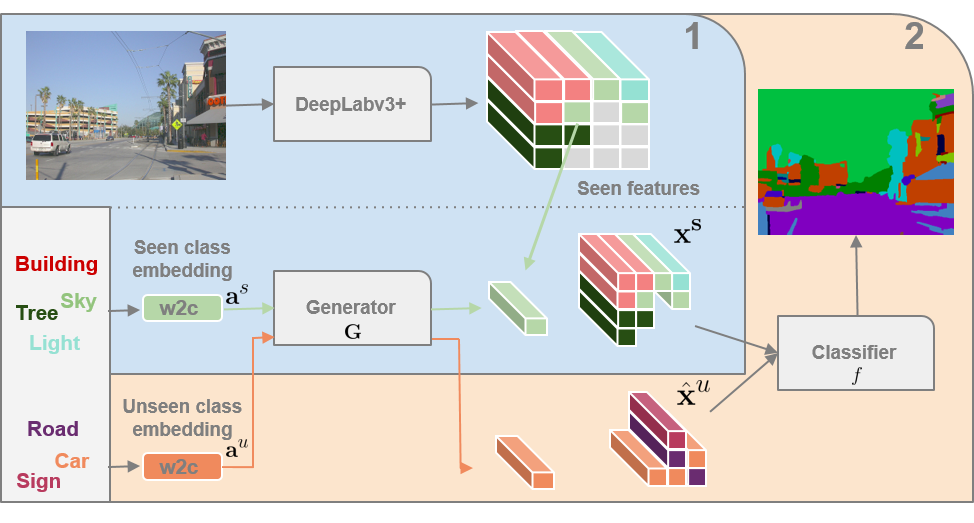

# Zero-Shot Semantic Segmentation

## Paper


[Zero-Shot Semantic Segmentation](https://arxiv.org/pdf/1906.00817.pdf)  
 [Maxime Bucher](https://maximebucher.github.io/), [Tuan-Hung Vu](https://tuanhungvu.github.io/) , [Matthieu Cord](http://webia.lip6.fr/~cord/), [Patrick Pérez](https://ptrckprz.github.io/)  
 valeo.ai, France  
 Neural Information Processing Systems (NeurIPS) 2019

If you find this code useful for your research, please cite our [paper](https://arxiv.org/pdf/1906.00817.pdf):

```
@inproceedings{bucher2019zero,
  title={Zero-Shot Semantic Segmentation},
  author={Bucher, Maxime and Vu, Tuan-Hung and Cord, Mathieu and P{\'e}rez, Patrick},
  booktitle={NeurIPS},
  year={2019}
}
```

## Abstract
Semantic segmentation models are limited in their ability to scale to large numbers of object classes. In this paper, we introduce the new task of zero-shot semantic segmentation: learning pixel-wise classifiers for never-seen object categories with zero training examples. To this end, we present a novel architecture, ZS3Net, combining a deep visual  segmentation model with an approach to generate visual representations from semantic word embeddings. By this way, ZS3Net addresses pixel classification tasks where both seen and unseen categories are faced at test time (so called "generalized" zero-shot classification). Performance is further improved by a self-training step that relies on automatic pseudo-labeling of pixels from unseen classes. On the two standard segmentation datasets, Pascal-VOC and Pascal-Context, we propose zero-shot benchmarks and set competitive baselines. For complex scenes as ones in the Pascal-Context dataset, we extend our approach by using a graph-context encoding to fully leverage spatial context priors coming from class-wise segmentation maps.

## Code

### Pre-requisites
* Python 3.6
* Pytorch >= 1.0 or higher
* CUDA 9.0 or higher

### Installation
1. Clone the repo:
```bash
$ git clone https://github.com/valeoai/ZS3
```

2. Install this repository and the dependencies using pip:
```bash
$ pip install -e ZS3
```

With this, you can edit the ZS3 code on the fly and import function and classes of ZS3 in other project as well.

3. Optional. To uninstall this package, run:
```bash
$ pip uninstall ZS3
```

You can take a look at the Dockerfile if you are uncertain about steps to install this project.

### Datasets

#### Pascal-VOC 2012
* **Pascal-VOC 2012**: Please follow the instructions [here](http://host.robots.ox.ac.uk/pascal/VOC/voc2012/index.html) to download images and semantic segmentation annotations.

* **Semantic Boundaries Dataset**: Please follow the instructions [here](http://home.bharathh.info/pubs/codes/SBD/download.html) to download images and semantic segmentation annotations. Use [this](http://home.bharathh.info/pubs/codes/SBD/train_noval.txt) train set, which excludes overlap with Pascal-VOC validation set. 

The Pascal-VOC and SBD datasets directory should have this structure:
```bash
ZS3/data/VOC2012/    % Pascal VOC and SBD datasets root
ZS3/data/VOC2012/ImageSets/Segmentation/     % Pascal VOC splits
ZS3/data/VOC2012/JPEGImages/     % Pascal VOC images
ZS3/data/VOC2012/SegmentationClass/      % Pascal VOC segmentation maps
ZS3/data/VOC2012/benchmark_RELEASE/dataset/img      % SBD images
ZS3/data/VOC2012/benchmark_RELEASE/dataset/cls      % SBD segmentation maps
ZS3/data/VOC2012/benchmark_RELEASE/dataset/train_noval.txt       % SBD train set
```


#### Pascal-Context

* **Pascal-VOC 2010**: Please follow the instructions [here](http://host.robots.ox.ac.uk/pascal/VOC/voc2010/index.html) to download images.

* **Pascal-Context**: Please follow the instructions [here](https://cs.stanford.edu/~roozbeh/pascal-context/) to download segmentation annotations.

The Pascal-Context dataset directory should have this structure:
```bash
ZS3/data/context/    % Pascal context dataset root
ZS3/data/context/train.txt     % Pascal context train split
ZS3/data/context/val.txt     % Pascal context val split
ZS3/data/context/full_annotations/trainval/     % Pascal context segmentation maps
ZS3/data/context/full_annotations/labels.txt     % Pascal context 459 classes
ZS3/data/context/classes-59.txt     % Pascal context 59 classes
ZS3/data/context/VOCdevkit/VOC2010/JPEGImages     % Pascal VOC images
```

### Training

#### Pascal-VOC
Follow steps below to train your model:

1. Train deeplabv3+ using Pascal VOC dataset and ResNet as backbone, pretrained on imagenet ([weights here](https://github.com/valeoai/ZS3/releases/download/v0.1/resnet_backbone_pretrained_imagenet_wo_pascalvoc.pth.tar)):

```Shell
python train_pascal.py
```
* Main options
    - `imagenet_pretrained_path`: Path to ImageNet pretrained weights.
    - `exp_path`: Path to saved logs and weights folder.
    - `checkname`: Name of the saved logs and weights folder.
    - `unseen_classes_idx`: List of idx of unseen classes.

* Trained deeplabv3+ weights
    -  [2 unseen classes](https://github.com/valeoai/ZS3/releases/download/v0.1/deeplab_pretrained_pascal_voc_02_unseen.pth.tar)
    -  [4 unseen classes](https://github.com/valeoai/ZS3/releases/download/v0.1/deeplab_pretrained_pascal_voc_04_unseen.pth.tar)
    -  [6 unseen classes](https://github.com/valeoai/ZS3/releases/download/v0.1/deeplab_pretrained_pascal_voc_06_unseen.pth.tar)
    -  [8 unseen classes](https://github.com/valeoai/ZS3/releases/download/v0.1/deeplab_pretrained_pascal_voc_08_unseen.pth.tar)
    -  [10 unseen classes](https://github.com/valeoai/ZS3/releases/download/v0.1/deeplab_pretrained_pascal_voc_10_unseen.pth.tar)


2. Train GMMN and finetune the last classification layer of the trained deeplabv3+ model:

```Shell
python train_pascal_GMMN.py
```
* Main options
    - `imagenet_pretrained_path`: Path to ImageNet pretrained weights.
    - `resume`: Path to deeplabv3+ weights.
    - `exp_path`: Path to saved logs and weights folder.
    - `checkname`: Name of the saved logs and weights folder.
    - `seen_classes_idx_metric`: List of idx of seen classes.
    - `unseen_classes_idx_metric`: List of idx of unseen classes.

* Final deeplabv3+ and GMMN weights
    -  [2 unseen classes](https://github.com/valeoai/ZS3/releases/download/v0.1/deeplab_pascal_voc_02_unseen_GMMN_final.pth.tar)
    -  [4 unseen classes](https://github.com/valeoai/ZS3/releases/download/v0.1/deeplab_pascal_voc_04_unseen_GMMN_final.pth.tar)
    -  [6 unseen classes](https://github.com/valeoai/ZS3/releases/download/v0.1/deeplab_pascal_voc_06_unseen_GMMN_final.pth.tar)
    -  [8 unseen classes](https://github.com/valeoai/ZS3/releases/download/v0.1/deeplab_pascal_voc_08_unseen_GMMN_final.pth.tar)
    -  [10 unseen classes](https://github.com/valeoai/ZS3/releases/download/v0.1/deeplab_pascal_voc_10_unseen_GMMN_final.pth.tar)


#### Pascal-Context
Follow steps below to train your model:

1. Train deeplabv3+ using Pascal Context dataset and ResNet as backbone, pretrained on imagenet ([weights here](https://github.com/valeoai/ZS3/releases/download/0.2/resnet_backbone_pretrained_imagenet_wo_pascalcontext.pth.tar)):

```Shell
python train_context.py
```
* Main options
    - `imagenet_pretrained_path`: Path to ImageNet pretrained weights.
    - `exp_path`: Path to saved logs and weights folder.
    - `checkname`: Name of the saved logs and weights folder.
    - `unseen_classes_idx`: List of idx of unseen classes.

* Trained deeplabv3+ weights
    -  [2 unseen classes](https://github.com/valeoai/ZS3/releases/download/0.2/deeplab_pretrained_pascal_context_02_unseen.pth.tar)
    -  [4 unseen classes](https://github.com/valeoai/ZS3/releases/download/0.2/deeplab_pretrained_pascal_context_04_unseen.pth.tar)
    -  [6 unseen classes](https://github.com/valeoai/ZS3/releases/download/0.2/deeplab_pretrained_pascal_context_06_unseen.pth.tar)
    -  [8 unseen classes](https://github.com/valeoai/ZS3/releases/download/0.2/deeplab_pretrained_pascal_context_08_unseen.pth.tar)
    -  [10 unseen classes](https://github.com/valeoai/ZS3/releases/download/0.2/deeplab_pretrained_pascal_context_10_unseen.pth.tar)


2. Train GMMN and finetune the last classification layer of the trained deeplabv3+ model:

```Shell
python train_context_GMMN.py
```
* Main options
    - `imagenet_pretrained_path`: Path to ImageNet pretrained weights.
    - `resume`: Path to deeplabv3+ weights.
    - `exp_path`: Path to saved logs and weights folder.
    - `checkname`: Name of the saved logs and weights folder.
    - `seen_classes_idx_metric`: List of idx of seen classes.
    - `unseen_classes_idx_metric`: List of idx of unseen classes.
    
* Final deeplabv3+ and GMMN weights
    -  [2 unseen classes](https://github.com/valeoai/ZS3/releases/download/0.2/deeplab_pascal_context_02_unseen_GMMN_final.pth.tar)
    -  [4 unseen classes](https://github.com/valeoai/ZS3/releases/download/0.2/deeplab_pascal_context_04_unseen_GMMN_final.pth.tar)
    -  [6 unseen classes](https://github.com/valeoai/ZS3/releases/download/0.2/deeplab_pascal_context_06_unseen_GMMN_final.pth.tar)
    -  [8 unseen classes](https://github.com/valeoai/ZS3/releases/download/0.2/deeplab_pascal_context_08_unseen_GMMN_final.pth.tar)
    -  [10 unseen classes](https://github.com/valeoai/ZS3/releases/download/0.2/deeplab_pascal_context_10_unseen_GMMN_final.pth.tar)


(2 bis). Train GMMN with graph context and finetune the last classification layer of the trained deeplabv3+ model:

```Shell
python train_context_GMMN_GCNcontext.py
```
* Main options
    - `imagenet_pretrained_path`: Path to ImageNet pretrained weights.
    - `resume`: Path to deeplabv3+ weights.
    - `exp_path`: Path to saved logs and weights folder.
    - `checkname`: Name of the saved logs and weights folder.
    - `seen_classes_idx_metric`: List of idx of seen classes.
    - `unseen_classes_idx_metric`: List of idx of unseen classes.
    
* Final deeplabv3+ and GMMN with graph context weights
    -  [2 unseen classes](https://github.com/valeoai/ZS3/releases/download/0.2/deeplab_pascal_context_02_unseen_GMMN_GC_final.pth.tar)
    -  [4 unseen classes](https://github.com/valeoai/ZS3/releases/download/0.2/deeplab_pascal_context_04_unseen_GMMN_GC_final.pth.tar)
    -  [6 unseen classes](https://github.com/valeoai/ZS3/releases/download/0.2/deeplab_pascal_context_06_unseen_GMMN_GC_final.pth.tar)
    -  [8 unseen classes](https://github.com/valeoai/ZS3/releases/download/0.2/deeplab_pascal_context_08_unseen_GMMN_GC_final.pth.tar)
    -  [10 unseen classes](https://github.com/valeoai/ZS3/releases/download/0.2/deeplab_pascal_context_10_unseen_GMMN_GC_final.pth.tar)

### Testing

```Shell
python eval_pascal.py
```
```Shell
python eval_context.py
```
* Main options
    - `resume`: Path to deeplabv3+ and GMMN weights.
    - `seen_classes_idx_metric`: List of idx of seen classes.
    - `unseen_classes_idx_metric`: List of idx of unseen classes.

## Acknowledgements
* This codebase is heavily borrowed from [pytorch-deeplab-xception](https://github.com/jfzhang95/pytorch-deeplab-xception).
* Special thanks for [@gabrieldemarmiesse](https://github.com/gabrieldemarmiesse) for his work in enhancing, cleaning and formatting this repository for release.

## License
ZS3Net is released under the [Apache 2.0 license](./LICENSE).
